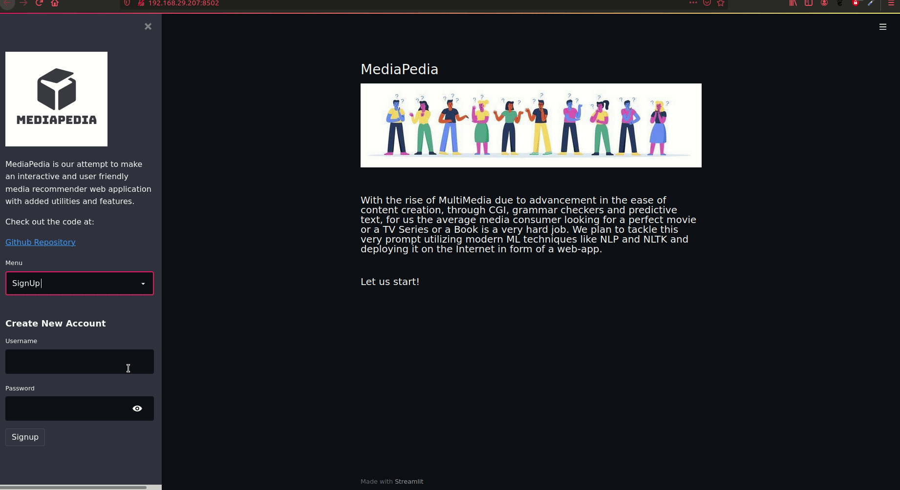
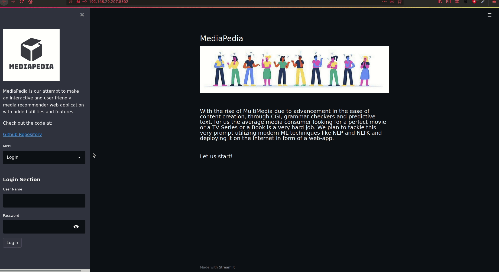
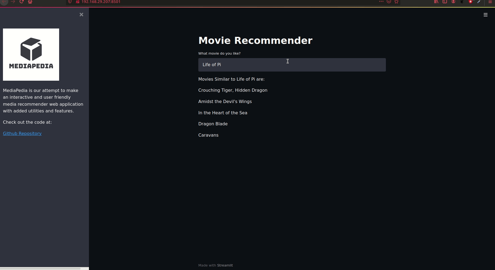

# MediaPedia 
[](https://www.python.org/)
[](https://opensource.org/licenses/Apache-2.0)
[](https://www.repostatus.org/#wip)
<br>

**MediaPedia** is our attempt to make an interactive and user friendly media recommender web application with added utilities and features.

## Motivation
With the rise of technology in the past 5 years with the internet and OTT revolution, we as a consumer are left with a plathora of content to watch from having countless web-series and ebooks to read now.

## Solution
Utilizing modern NLP architectures and easy to use Python full stack development libraries, we present a multi-level interactive web-application that is able to recommend TVShows, Movies and Books using Collaborative and Content based Recommnedation system.

## Tutorial
### Signup<br>
<br>

### Login<br>
<br>

### Movie Recommendation<br>
<br>

## How to use (Code)<br>
Clone the repository<br>
``` git clone https://github.com/aryankargwal/mediapedia.git```<br>

Setting up the python requirements using [requirements.txt](requirements.txt)<br>
``` pip install -r requirements.txt```<br>

Running the web application<br>
``` streamlit run app.py```<br> 


## Steps of development
- [x] Landing Page
- [x] Login System with Database
- [x] Movie DataLoader
- [x] Book Dataloader
- [x] Movie Model
- [ ] Book Model

## License 
This project is under the Apache License. See [LICENSE](LICENSE) for Details.
